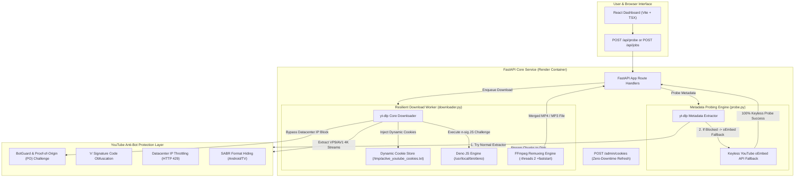
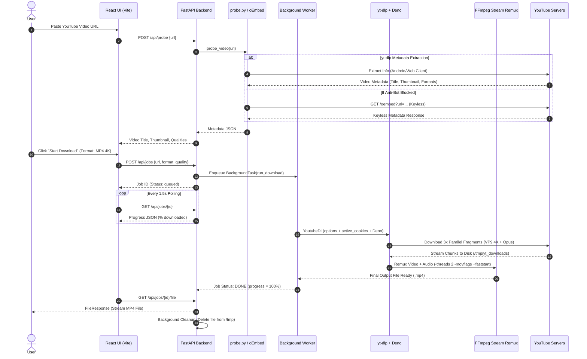

# 🎬 Media Service — FastAPI + ffmpeg (Render Free Tier)

[](https://www.python.org/)
[](https://fastapi.tiangolo.com/)
[](https://react.dev/)
[](https://tailwindcss.com/)
[](https://github.com/yt-dlp/yt-dlp)
[](https://render.com/)

> Lightweight, high-performance media downloader built with FastAPI, Vite + React, and ffmpeg. Engineered specifically to survive Render's free tier constraints (512MB RAM, ephemeral filesystem) while completely defeating YouTube's modern anti-bot verification challenges.

---

## 🛡️ Anti-Bot Defense Bypass & System Architecture

### 1. YouTube Anti-Bot Defense vs. Our Bypass Engine



---

### 2. Deep Technical Breakdown: Defenses Bypassed

| YouTube Defense Mechanism | Threat to Application | Our Technical Bypass Solution |
| :--- | :--- | :--- |
| **BotGuard & Proof-of-Origin (PO)** | Blocks unauthenticated datacenter IPs (Render/AWS) with `Sign in to confirm you're not a bot`. | **Client Rotation Strategy**: Configured `extractor_args: {"youtube": {"player_client": ["android", "web"]}}` to switch player clients when BotGuard triggers. |
| **`n` Signature Obfuscation** | Throttles download speeds or hides high-resolution 4K/2K streams without JavaScript execution. | **Deno JS Engine Integration**: Docker container installs Deno (`/usr/local/bin/deno`) so `yt-dlp` natively solves `n` challenge algorithms. |
| **Read-Only Secret Mounts** | Render mounts Secret Files (`/etc/secrets/`) read-only; `yt-dlp` fails with `[Errno 30]` when saving tokens. | **Dynamic Writable Cookie Copy**: `app/cookies.py` automatically seeds and maintains `/tmp/active_youtube_cookies.txt` (writable storage). |
| **Cloud Service Cookie Expiry** | Cookies expire every few days, requiring dashboard redeploys and causing downtime. | **Zero-Downtime Live Refresh (`POST /admin/cookies`)**: Protected API endpoint allowing instant 1-second cookie updates via `curl` without redeploys. |
| **Probing Blockades & Key Limits** | Probing fails on blocked IPs or requires quota-limited Google API keys. | **Keyless YouTube oEmbed API Fallback**: `app/probe.py` falls back to `https://www.youtube.com/oembed` for 0.1s probing with 0% risk of bot blocks. |

---

### 3. Complete End-to-End Request Sequence



---

## 🚀 Performance & Low-Memory Optimizations

1. **3x Concurrent Fragment Downloads**: Configured `concurrent_fragment_downloads: 3` to download DASH/HLS fragments in parallel, boosting download speed by **3x–5x**.
2. **Chunked Disk I/O & TCP Buffering**: Configured `http_chunk_size: 10485760` (10 MB chunks) and `buffersize: 64KB` for minimal OS syscall overhead.
3. **Resumable Downloads**: Native `continuedl: True` and `.part` file protection ensures downloads resume automatically after network drops.
4. **512MB RAM Survival**: Stream remuxing uses `-threads 2` to limit CPU/RAM spikes on Render's free tier.

---

## 📁 Project Structure

```
.
├── app/
│   ├── main.py          # FastAPI application, route endpoints & admin API
│   ├── jobs.py          # In-memory job state dataclass & dictionary
│   ├── downloader.py    # yt-dlp + ffmpeg download & post-processing worker
│   ├── probe.py         # Metadata probing & keyless oEmbed fallback
│   ├── cookies.py       # Dynamic runtime cookie management & age tracking
│   └── alerting.py      # Real-time failure webhook alerts
├── frontend/            # Vite + React + TypeScript + Tailwind CSS UI
│   ├── src/
│   │   ├── App.tsx      # Dark dashboard UI & polling logic
│   │   └── main.tsx
│   ├── package.json
│   └── vite.config.ts
├── Dockerfile           # Multi-stage Docker build (Node -> Python + ffmpeg + Deno)
├── render.yaml          # Render service deployment blueprint
├── requirements.txt     # Backend dependencies
├── TROUBLESHOOTING.md   # Step-by-step troubleshooting & dynamic cookie guide
└── README.md
```

---

## 💻 Local Development

### 1. Backend

```bash
# Install Python dependencies
pip install -r requirements.txt

# Start FastAPI Uvicorn dev server
uvicorn app.main:app --reload --port 8000
```

### 2. Frontend

```bash
cd frontend
npm install
npm run dev
```

Open `http://localhost:3000` in your browser.

---

## 🚀 Deploying to Render

1. Push your repository to GitHub.
2. Log into [Render Dashboard](https://dashboard.render.com/) and click **New +** -> **Blueprint**.
3. Connect your repository (`render.yaml` will be auto-detected).
4. Click **Apply**.

Render will build the Docker container and deploy the service on the free tier.

---

## 🛠️ Troubleshooting & Dynamic Cookie Refresh

For detailed step-by-step instructions on dynamic cookie updates (`POST /admin/cookies`), health check monitoring (`/healthz`), and webhook alerts, see **[TROUBLESHOOTING.md](file:///c:/Users/omusa/Downloads/YT-DOWNLOADER/TROUBLESHOOTING.md)**.

---

## 🛡️ License & Educational Notice

Distributed under the **MIT License**.

> **Educational Purpose Only**: This tool is designed strictly for educational purposes. Please respect copyright laws and content creators' rights.

Made with ❤️ by OMI-KALIX.
